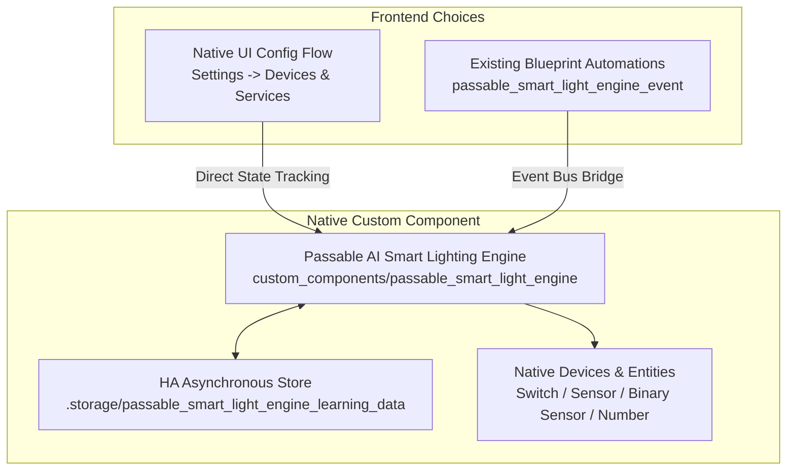

# 🧠 Passable AI Smart Lighting Controller

[](https://github.com/hacs/default)
[](https://github.com/GBear09/passable-smart-light-engine/releases)
[](LICENSE)

An adaptive, machine-learning-inspired lighting automation system for Home Assistant. Runs natively on Home Assistant Core's asynchronous engine with full HACS 1-click install and update support.

Configure rooms seamlessly using the **Native UI Config Flow** (with zero automations required), or keep using your existing **Blueprint automations** with the built-in drop-in event bridge!

---

## ⚙️ Key Features

- **📈 Adaptive Lux Yield Curve Learning:** Calculates how much ambient lux each 1% of brightness produces in your specific room, adjusting dimmer levels smoothly to maintain your target lux.
- **🎓 Dual-Track Preference Learning:** Learns your personal brightness preferences based on sun elevation whenever you manually override the lights.
- **⏱️ Sensor Lag Compensation:** Asynchronously waits for slow sensors (e.g., Philips Hue, Zigbee motion/illuminance sensors) to report final lux values before saving preference data.
- **🛡️ Trajectory-Bounded Echo Guard:** Intelligent detection to prevent delayed hardware status updates or multi-bulb group state updates from causing false manual override triggers (with a 30s grace window and 8% quantization tolerance).
- **☀️ Sun-Based Circadian Rhythm:** Dynamically shifts color temperature between configured warm and cool Kelvin values based on sun elevation throughout the day.
- **📺 Media Player Integration:** Automatically applies learned or seeded TV/media lighting presets when media players are active.
- **🌙 Late Night Mode:** Overrides sun-based targeting during night hours with configurable start/stop times or helper entity triggers.
- **🛑 Flexible Bypasses & Overrides:** Support for Freeze Bypasses (stay as-is), Force-Off Bypasses (e.g., Away mode), and customizable manual override timeouts.
- **💡 Task Floor (`min_occupied_pct`):** Prevents lights from dropping below a minimum brightness in task-oriented rooms (kitchens, offices) regardless of ambient lux readings.
- **⚡ Power Grid Outage Protection:** Absorbs light turn-on spikes when power is restored to prevent accidental manual override locks.
- **🎛️ Interactive Dashboard Controls:** Exposes native sliders, switches, and diagnostic sensors directly to your Home Assistant dashboard.
- **🧹 Dynamic Active Rooms State Sync:** Publishes `active_rooms` and `available_reset_types` state attributes to `sensor.passable_smart_light_engine_ready`, allowing zero-helper dynamic dashboard cards & popup actions to auto-populate learning data reset options.

---

## 📂 Architecture: Dual-Mode Operation



1. **Native UI Setup (Recommended):** Add rooms directly in **Settings → Devices & Services**. The integration manages presence, illuminance, and light levels in pure Python with zero automations needed.
2. **Blueprint Bridge (100% Backward Compatible):** If you already have automations created from the blueprint, the integration listens to the Home Assistant event bus (`smart_light_engine_event` and `passable_smart_light_engine_event`) and acts as a direct, drop-in replacement for the old Pyscript backend.

---

## 🚀 Installation via HACS

1. Open **HACS** in your Home Assistant instance.
2. Click the three dots in the top right corner and select **Custom repositories**.
3. Add repository URL:
   ```text
   https://github.com/GBear09/passable-smart-light-engine
   ```
4. Select **Type:** `Integration`.
5. Click **Add**, then find **Passable AI Smart Lighting Controller** and click **Download**.
6. Restart Home Assistant.

---

## 🛠️ Configuration

### Option A: Native UI Config Flow (Zero Automations)

1. Go to **Settings → Devices & Services → Add Integration**.
2. Search for **Passable AI Smart Lighting Controller**.
3. **Step 1: Core Room Setup**
   * **Room ID:** Unique room identifier with no spaces (e.g. `living_room`).
   * **Light Entity:** The main light or light group to control.
   * **Presence Sensors:** One or more binary sensors (PIR, mmWave).
   * **Illuminance Sensor:** Ambient lux sensor.
   * **Target Lux (Seed):** Baseline lux to maintain (Default: `40`).
   * **Default Lux Ratio:** Initial lux per 1% brightness estimate (Default: `1.0`).
   * **Vacancy Timeout:** Minutes to wait after room becomes empty before turning lights off (Default: `5`).
   * **Minimum Occupied Brightness:** Floor brightness for task rooms (Default: `0%`).
4. **Step 2: Behaviors, Bypasses & Helpers**
   * **Manual Override Tracking:** Select an existing `input_boolean` helper, OR check *Create Dedicated Native Manual Override Switch* to let the integration manage one automatically.
   * **Freeze Bypasses:** Select existing helpers (e.g. `input_boolean.sleeping_in_living_room`, bedtime booleans) and/or check *Create Dedicated Native Freeze Switch*.
   * **Force-Off Bypasses:** Select existing helpers (e.g. `input_boolean.away_mode_all_lights_bypass`).
   * **Circadian Rhythm:** Enable Kelvin shifting and define warm/cool ranges.
   * **Late Night Mode:** Configure fixed times or entity triggers with seed brightness.
   * **Media Players:** Select TVs/media players for automatic dimming.
5. Click **Submit**. A dedicated Home Assistant Device is created for the room!

---

### Option B: Blueprint Bridge Setup

If you prefer using Home Assistant's Blueprint UI or wish to maintain your existing blueprint automations:
1. The blueprint is bundled at `blueprints/automation/gbear09/passable_smart_light_engine.yaml`.
2. Existing automations that fire `smart_light_engine_event` or `passable_smart_light_engine_event` are handled automatically by the native integration backend with zero reconfiguration required.

---

## 🎛️ Entities Created per Room

When configured via the Native UI, the integration provisions a room Device with the following entities:

| Entity ID | Domain | Description |
| :--- | :--- | :--- |
| `switch.smart_lighting_<room>` | `switch` | Master toggle to enable/disable automation for this room. |
| `switch.<room>_circadian_rhythm` | `switch` | Toggle circadian color temperature shifting for this room. |
| `switch.<room>_manual_override` | `switch` | *(Optional)* Dedicated manual override lock switch. |
| `switch.<room>_freeze_bypass` | `switch` | *(Optional)* Dedicated freeze bypass switch. |
| `number.<room>_target_lux_setting` | `number` | Interactive slider to adjust baseline target lux directly on dashboards. |
| `sensor.<room>_lux_yield` | `sensor` | Diagnostic sensor reporting current calculated lux per 1% brightness (`lx/%`). |
| `sensor.<room>_target_lux` | `sensor` | Current blended target ambient lux based on sun elevation (`lx`). |
| `sensor.<room>_active_mode` | `sensor` | Operational mode (`occupied`, `vacant`, `late_night`, `media`, `manual_override`, `frozen`, `forced_off`). |
| `binary_sensor.<room>_room_presence` | `binary_sensor` | Composite presence state of the room. |
| `binary_sensor.<room>_manual_override_active` | `binary_sensor` | Shows whether manual override is active with remaining timeout seconds. |

### System-Wide Entities:
* `sensor.passable_smart_light_engine_ready`: Publishes `active_rooms`, `room_datasets`, and `available_reset_types` state attributes to power dynamic dashboard popups.

---

## 🔄 Services

### `passable_smart_light_engine.reset_learning_data`
Resets learned lighting curves, user sun preferences, media levels, or late-night presets for a specific room or all rooms. *(Also registered under legacy alias `smart_light_engine.reset_learning_data`)*.

```yaml
service: passable_smart_light_engine.reset_learning_data
data:
  room_id: "living_room" # Optional: omit to reset all rooms
  reset_type: "all"      # Options: all, user_prefs, room_curves, media_prefs, late_night_prefs
```

---

## 📦 Automatic Data Migration

On first launch, the integration automatically checks for and imports existing `learning_data.json` files from legacy Pyscript directories:
- `/config/pyscript/apps/smart_light_engine/learning_data.json`
- `/config/pyscript/apps/passable_smart_light_engine/learning_data.json`

All historical room yield curves and user preferences are imported into Home Assistant's native asynchronous storage (`.storage/`) without any data loss or retraining needed.

---

## 📄 License

Distributed under the [MIT License](LICENSE).
