# 💡 Passable Adaptive Smart Lighting Controller

[](https://github.com/hacs/default)
[](https://github.com/GBear09/passable-smart-light-engine/releases)
[](LICENSE)

An adaptive, self-learning statistical lighting automation system for Home Assistant. Runs natively on Home Assistant Core's asynchronous engine with full HACS 1-click install and update support.

Configure rooms seamlessly using the **Native UI Config Flow** (with zero automations required), or keep using your existing **Blueprint automations** with the built-in drop-in event bridge!

---

## ⚙️ Key Features

- **📈 Adaptive Lux Yield Curve Learning:** Calculates how much ambient lux each 1% of brightness produces in your specific room, adjusting dimmer levels smoothly to maintain your target lux.
- **🎓 Dual-Track Preference Learning:** Learns your personal brightness preferences based on sun elevation whenever you manually override the lights.
- **⏱️ Sensor Lag Compensation:** Asynchronously waits for slow sensors (e.g., Philips Hue, Zigbee motion/illuminance sensors) to report final lux values before saving preference data.
- **🛡️ Trajectory-Bounded Echo Guard:** Intelligent detection to prevent delayed hardware status updates or multi-bulb group state updates from causing false manual override triggers (with a 30s grace window and 8% quantization tolerance).
- **☀️ Sun-Based Circadian Rhythm:** Dynamically shifts color temperature between configured warm and cool Kelvin values based on sun elevation throughout the day.
- **📺 Media Player Integration:** Automatically applies learned or seeded TV/media lighting presets when media players are active.
- **🌙 Late Night Mode:** Overrides sun-based targeting during night hours with configurable start/stop times or helper entity triggers.
- **🛑 Flexible Bypasses & Overrides:** Support for Freeze Bypasses (stay as-is), Force-Off Bypasses (e.g., Away mode), and customizable manual override timeouts.
- **💡 Task Floor (`min_occupied_pct`):** Prevents lights from dropping below a minimum brightness in task-oriented rooms (kitchens, offices) regardless of ambient lux readings.
- **⚡ Power Grid Outage Protection:** Absorbs light turn-on spikes when power is restored to prevent accidental manual override locks.
- **🎛️ Interactive Dashboard Controls:** Exposes native sliders, switches, and diagnostic sensors directly to your Home Assistant dashboard.
- **🧹 Dynamic Active Rooms State Sync:** Publishes `active_rooms` and `available_reset_types` state attributes to `sensor.passable_smart_light_engine_ready`, allowing zero-helper dynamic dashboard cards & popup actions to auto-populate learning data reset options.
- **🏡 Native Hybrid Presence Simulation:** Replaces external replay integrations with a built-in, vacation-immune hybrid presence simulator. Automatically replays genuine occupied history with humanized time jitter (±15m) and falls back to realistic synthetic evening routines (living/kitchen early evening, bedroom bedtime transitions, nighttime quieting). Features dynamic label targeting (`lights_presence_simulation`), drop-in switch compatibility (`switch.simulate_presence_away_mode`), and graceful night arrival handovers.

---

## 📂 System Architecture

```mermaid
flowchart TD
    subgraph Inputs ["1. Inputs, Context & Telemetry"]
        direction TB
        UI_CFG["Native UI Config Flow<br/>(Rooms & Simulation Options)"]
        BP_EVT["Blueprint Automations<br/>(passable_smart_light_engine_event)"]
        SENS_PRES["Room Presence Sensors<br/>(PIR, mmWave, Multi-sensor)"]
        SENS_LUX["Ambient Lux Sensors<br/>(Illuminance Telemetry)"]
        ENV_ASTRO["Environmental & State Context<br/>(sun.sun, Media Players, Bypasses)"]
        LBL_SIM["HA Entity Registry<br/>(Label: lights_presence_simulation)"]
        REC_HIST["Home Assistant Recorder<br/>(Past Occupied History Database)"]
    end

    subgraph Core ["2. Passable Smart Lighting Engine Core"]
        direction TB

        subgraph RoomControllers ["Autonomous Room Controllers (RoomController)"]
            direction TB
            PRES_MGR["Presence & Vacancy Tracker<br/>- Multi-sensor entry grace & dwell<br/>- Post-vacancy off timers"]
            LUX_MGR["Lux Smoothing & Lag Compensation<br/>- 180s TTL sample aging<br/>- Sensor latency compensation"]
            TGT_MGR["Target Lux Blender<br/>- Sun elevation curve blending<br/>- Late-night & Media overrides"]
            CIRC_MGR["Circadian Rhythm Engine<br/>- Warm/cool Kelvin sun calculation"]
            STAT_DIM["Statistical Dimmer & Lux Yield Engine<br/>- Real-time lx/% curve calculation<br/>- Closed-loop brightness solver"]
            ECHO_MGR["Trajectory-Bounded Echo Guard<br/>- Hardware latency tolerance<br/>- Manual override discrimination"]
            ML_MGR["Machine Learning & Preferences<br/>- Sun elevation vs brightness curves<br/>- Automatic preference adaptation"]
        end

        subgraph PresenceSimulation ["Native Presence Simulation Engine"]
            direction TB
            SIM_COORD["Simulation Orchestrator<br/>(switch.simulate_presence_away_mode)"]
            REPLAY_MGR["Smart Historical Replay<br/>(Vacation-skipping occupied window)"]
            SYNTH_MGR["Synthetic Evening Routine Generator<br/>- Living/Kitchen evening dwell<br/>- Transitional & bedtime wind-down"]
            JITTER_MGR["Humanized Jitter Engine<br/>(±15 min randomization)"]
            HANDOVER_MGR["Night Arrival Handover<br/>- Graceful vacancy handover<br/>- Morning/vacation clean sweep"]
        end

        ARBITRATION["Engine Arbitration & Context Manager<br/>- Suppresses is_forced_off bypasses during simulation<br/>- Prevents false manual overrides & shields ML yield data"]
    end

    subgraph Storage ["3. Persistent Storage Layer (.storage/)"]
        JSON_STORE["HA Native Asynchronous Storage<br/>- Dynamic Room Yield Curves (lx/%)<br/>- User Sun Preferences<br/>- Media & Late-Night Learned Offsets"]
        PYSCRIPT_MIG["Legacy Pyscript Migration<br/>(Auto-imported on first startup)"]
    end

    subgraph Outputs ["4. Actuation, Entities & UI Controls"]
        direction TB
        ROOM_ENT["Per-Room Native Entities<br/>- switch.smart_lighting_<room><br/>- switch.<room>_circadian_rhythm<br/>- number.<room>_target_lux_setting<br/>- sensor.<room>_active_mode<br/>- sensor.<room>_lux_yield & target_lux<br/>- binary_sensor.<room>_room_presence<br/>- Dataset reset controls"]
        SYS_ENT["System-Wide Entities & Diagnostics<br/>- switch.simulate_presence_away_mode<br/>- sensor.presence_simulation_status<br/>- sensor.passable_smart_light_engine_ready"]
        LIGHTS["Physical Lights & Light Groups<br/>(Target brightness, Kelvin & smooth transitions)"]
    end

    %% Wiring
    UI_CFG -->|"Configure Rooms & Simulation"| Core
    BP_EVT -->|"Event Bus Bridge"| RoomControllers

    SENS_PRES --> PRES_MGR
    SENS_LUX --> LUX_MGR
    ENV_ASTRO --> TGT_MGR
    ENV_ASTRO --> CIRC_MGR
    ENV_ASTRO --> ARBITRATION

    LBL_SIM --> SIM_COORD
    REC_HIST --> REPLAY_MGR

    REPLAY_MGR --> SIM_COORD
    SYNTH_MGR --> SIM_COORD
    JITTER_MGR --> SIM_COORD
    SIM_COORD --> HANDOVER_MGR
    HANDOVER_MGR --> ARBITRATION

    PRES_MGR --> STAT_DIM
    LUX_MGR --> STAT_DIM
    TGT_MGR --> STAT_DIM
    CIRC_MGR --> STAT_DIM
    ECHO_MGR --> ML_MGR

    STAT_DIM <--> ARBITRATION
    ARBITRATION <--> RoomControllers

    ML_MGR <--> JSON_STORE
    STAT_DIM <--> JSON_STORE
    PYSCRIPT_MIG --> JSON_STORE

    RoomControllers --> ROOM_ENT
    PresenceSimulation --> SYS_ENT
    ARBITRATION --> LIGHTS
```



### Architectural Highlights

1. **Dual Configuration & Ingestion Paths:**
   - **Native UI Setup (Recommended):** Add and configure rooms via **Settings → Devices & Services**. The integration manages presence, illuminance, and lighting levels entirely in Python without requiring any Home Assistant automations or YAML.
   - **Blueprint Bridge (100% Backward Compatible):** Seamlessly bridges legacy Home Assistant Blueprint automations via `passable_smart_light_engine_event` and `smart_light_engine_event` on the internal event bus.
2. **Autonomous Room Controllers:** Each room executes an independent control loop combining multi-sensor presence fusion, TTL-aged lux smoothing (180s sample aging), sun-elevation circadian Kelvin shifting, and task floor constraints.
3. **Statistical Dimmer & Adaptive Yield Learning:** Continually calculates real-time room yield curves ($lx/\%$). When users adjust brightness, the engine learns user preferences relative to sun elevation, automatically applying guardrails to prevent data distortion.
4. **Native Hybrid Presence Simulation:** Replays genuine occupied history from the Home Assistant recorder past empty vacation periods, automatically falling back to synthetic evening routines with humanized $\pm 15$m jitter, dynamic entity registry label resolution (`lights_presence_simulation`), and seamless night arrival room handover.
5. **Central Engine Arbitration & Coordination:** Harmonizes simulation events with room controllers, suppresses force-off bypasses during simulation, absorbs power-spike turn-ons, and shields machine learning models from non-user actions.

---

## 🚀 Installation via HACS

1. Open **HACS** in your Home Assistant instance.
2. Click the three dots in the top right corner and select **Custom repositories**.
3. Add repository URL:
   ```text
   https://github.com/GBear09/passable-smart-light-engine
   ```
4. Select **Type:** `Integration`.
5. Click **Add**, then find **Passable Adaptive Smart Lighting Controller** and click **Download**.
6. Restart Home Assistant.

---

## 🛠️ Configuration

### Option A: Native UI Config Flow (Zero Automations)

1. Go to **Settings → Devices & Services → Add Integration**.
2. Search for **Passable Adaptive Smart Lighting Controller**.
3. **Step 1: Core Room Setup**
   * **Room ID:** Unique room identifier with no spaces (e.g. `living_room`).
   * **Light Entity:** The main light or light group to control.
   * **Presence Sensors:** One or more binary sensors (PIR, mmWave).
   * **Illuminance Sensor:** Ambient lux sensor.
   * **Target Lux (Seed):** Baseline lux to maintain (Default: `40`).
   * **Default Lux Ratio:** Initial lux per 1% brightness estimate (Default: `1.0`).
   * **Vacancy Timeout:** Minutes to wait after room becomes empty before turning lights off (Default: `5`).
   * **Minimum Occupied Brightness:** Floor brightness for task rooms (Default: `0%`).
4. **Step 2: Behaviors, Bypasses & Helpers**
   * **Manual Override Tracking:** Select an existing `input_boolean` helper, OR check *Create Dedicated Native Manual Override Switch* to let the integration manage one automatically.
   * **Freeze Bypasses:** Select existing helpers (e.g. `input_boolean.sleeping_in_living_room`, bedtime booleans) and/or check *Create Dedicated Native Freeze Switch*.
   * **Force-Off Bypasses:** Select existing helpers (e.g. `input_boolean.away_mode_all_lights_bypass`).
   * **Circadian Rhythm:** Enable Kelvin shifting and define warm/cool ranges.
   * **Late Night Mode:** Configure fixed times or entity triggers with seed brightness.
   * **Media Players:** Select TVs/media players for automatic dimming.
5. Click **Submit**. A dedicated Home Assistant Device is created for the room!

---

### Option B: Blueprint Bridge Compatibility

If you currently have room automations configured using the Home Assistant Blueprint:
* You do not need to delete or recreate your automations.
* The native integration listens directly on Home Assistant's event bus for `smart_light_engine_event` and `passable_smart_light_engine_event`.
* The integration acts as a direct, high-performance drop-in backend replacing the old Pyscript file.

---

## 🎛️ Entities Created per Room

When configured via the Native UI, the integration provisions a room Device with the following entities:

| Entity ID | Domain | Description |
| :--- | :--- | :--- |
| `switch.smart_lighting_<room>` | `switch` | Master toggle to enable/disable automation for this room. |
| `switch.<room>_circadian_rhythm` | `switch` | Toggle circadian color temperature shifting for this room. |
| `switch.<room>_manual_override` | `switch` | *(Optional)* Dedicated manual override lock switch. |
| `switch.<room>_freeze_bypass` | `switch` | *(Optional)* Dedicated freeze bypass switch. |
| `number.<room>_target_lux_setting` | `number` | Interactive slider to adjust baseline target lux directly on dashboards. |
| `sensor.<room>_lux_yield` | `sensor` | Diagnostic sensor reporting current calculated lux per 1% brightness (`lx/%`). |
| `sensor.<room>_target_lux` | `sensor` | Current blended target ambient lux based on sun elevation (`lx`). |
| `sensor.<room>_active_mode` | `sensor` | Operational mode (`occupied`, `vacant`, `late_night`, `media`, `manual_override`, `frozen`, `forced_off`). |
| `binary_sensor.<room>_room_presence` | `binary_sensor` | Composite presence state of the room. |
| `binary_sensor.<room>_manual_override_active` | `binary_sensor` | Shows whether manual override is active with remaining timeout seconds. |
| `select.<room>_reset_dataset_target` | `select` | Dropdown selector to choose which dataset to reset (`all`, `user_prefs`, `room_curves`, `media_prefs`, `late_night_prefs`). |
| `button.<room>_reset_selected_learning_data` | `button` | Action button to reset the selected dataset for this room. |
| `button.<room>_reset_all_room_learning_data` | `button` | 1-click button to reset all learning datasets for this room. |

### System-Wide Entities:
* `sensor.passable_smart_light_engine_ready`: Publishes `active_rooms`, `room_datasets`, and `available_reset_types` state attributes to power dynamic dashboard popups.
* `switch.simulate_presence_away_mode`: Master presence simulation toggle. Drop-in compatible with existing automations. Exposes live attributes including `status`, `active_simulated_lights`, and `next_event`.
* `sensor.presence_simulation_status`: Real-time operational diagnostics (`idle`, `planning`, `simulating`, `handover`).

---

## 🏡 Native Presence Simulation (Away Mode)

The integration includes a built-in, vacation-immune **Presence Simulation Engine** that replaces third-party replay components:

### Setup & Configuration
- **Zero Disruption / Out-of-the-Box:** Works immediately upon upgrade. The engine auto-discovers lights labeled `lights_presence_simulation` and automatically provisions `switch.simulate_presence_away_mode`. Your existing room configurations are completely untouched—no rooms need to be deleted, re-added, or reconfigured.
- **Optional Dedicated Entry:** If you want to customize simulation parameters (e.g. lookback days, jitter minutes, night arrival grace period, or custom label), go to **Settings > Devices & Services > Add Integration > Passable Adaptive Smart Lighting Controller** and choose **Configure Presence Simulation**. This creates an independent entry alongside your existing rooms.

### Key Highlights
- **🎭 Hybrid Simulation Strategy:**
  - **Smart History Replay:** Queries Home Assistant's recorder for your last genuine `Home` period (looking back past empty vacation days, eliminating the "week 2 vacation blackout" bug).
  - **Realistic Synthetic Routine Fallback:** If recorder history is purged or unavailable, automatically generates natural human evening routines:
    - *Living / Kitchen / Dining:* Active in early evening (sunset to ~10:30 PM) with natural 25–60 minute dwell times.
    - *Transitional (Stairs / Hallway / Foyer):* Brief 4–12 minute periodic visits.
    - *Bedrooms:* Wind-down and bedtime routines (~9:45 PM to 11:15 PM) before shutting down for the night.
- **🏷️ Dynamic Label Targeting:** Tag any light in Home Assistant with the label `lights_presence_simulation` (or custom label). The engine resolves target entities dynamically on every cycle—no configuration reloads needed.
- **🎲 Humanized Jitter:** Adds randomized ±15-minute time jitter to all transitions so the house never turns on lights at the exact same minute.
- **🛡️ Full Engine Arbitration:** When a room is actively simulating presence, the engine suppresses force-off bypasses, prevents false manual override locks, and protects learned lux yield curves from data pollution.
- **🚪 Graceful Night Arrival Handover:**
  - **At Sunrise or While Still Away:** Sweeps off all active simulated lights.
  - **Arriving Home at Night (`sun < 0` and `home_mode == Home`):** Does **not** cause an abrupt blackout. Active lights are gracefully handed over to room controllers, starting a 5-minute vacancy grace period for vacant rooms and keeping occupied rooms warmly illuminated.

---

## 🔄 Services

### `passable_smart_light_engine.reset_learning_data`
Resets learned lighting curves, user sun preferences, media levels, or late-night presets for a specific room or all rooms. *(Also registered under legacy alias `smart_light_engine.reset_learning_data`)*.

```yaml
service: passable_smart_light_engine.reset_learning_data
data:
  room_id: "living_room" # Optional: omit to reset all rooms
  reset_type: "all"      # Options: all, user_prefs, room_curves, media_prefs, late_night_prefs
```

### `passable_smart_light_engine.start_presence_simulation`
Manually starts presence simulation across all lights with label `lights_presence_simulation`.

### `passable_smart_light_engine.stop_presence_simulation`
Manually stops presence simulation. If stopping at night while home, performs graceful room handover; otherwise sweeps off simulated lights.

---

## 📦 Automatic Data Migration

On first launch, the integration automatically checks for and imports existing `learning_data.json` files from legacy Pyscript directories:
- `/config/pyscript/apps/smart_light_engine/learning_data.json`
- `/config/pyscript/apps/passable_smart_light_engine/learning_data.json`

All historical room yield curves and user preferences are imported into Home Assistant's native asynchronous storage (`.storage/`) without any data loss or retraining needed.

---

## 📄 License

Distributed under the [MIT License](LICENSE).
